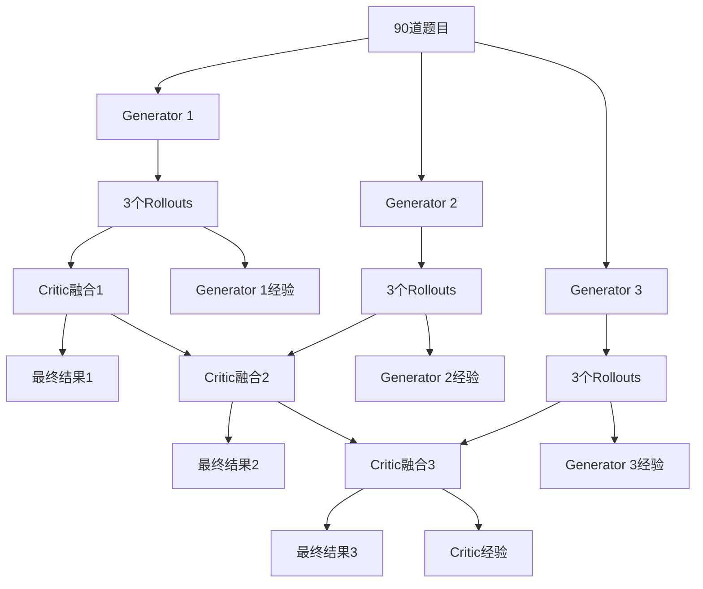

# GRPO Training 详细技术文档

## 📋 目录

1. [系统概述](#系统概述)
2. [核心概念](#核心概念)
3. [架构设计](#架构设计)
4. [数据流程](#数据流程)
5. [关键组件详解](#关键组件详解)
6. [训练过程](#训练过程)
7. [奖励机制](#奖励机制)
8. [经验提取](#经验提取)
9. [使用指南](#使用指南)
10. [常见问题](#常见问题)

---

## 系统概述

GRPO Training 是一个基于因果推理的多智能体训练框架，用于提升数学和物理问题的解题能力。系统采用**Training-Free GRPO (Group Relative Policy Optimization)** 方法，通过多个生成器和批判者的协作学习，逐步积累解题经验。

### 🎯 训练目标
- 提升LLM在复杂数学/物理问题上的解题准确率
- 学习因果推理和问题分解能力
- 积累解题经验和策略

### 📊 训练数据
- **总题数**: 90道题目
- **数据来源**:
  - AIME2024: 30道数学竞赛题
  - AIME2025: 30道数学竞赛题
  - Physics: 30道物理题

---

## 核心概念

### 1. Generator (生成器)
三个独立的生成器，每个负责生成因果图和解答：

- **Generator 1**: 基础生成器，使用标准奖励权重
- **Generator 2**: 侧重答案正确性的生成器
- **Generator 3**: 侧重答案正确性的生成器

### 2. Critic (批判者)
负责融合多个生成器的结果，选择最优解：
- 接收3个生成器各自的3个rollouts
- 使用LLM进行智能融合
- 计算融合质量奖励

### 3. Rollout (推演)
对于每个问题，每个生成器产生3个rollouts：
- **Rollout 1**: 第一个解题尝试
- **Rollout 2**: 第二个解题尝试
- **Rollout 3**: 第三个解题尝试

### 4. GRPO经验
从成功的rollouts中提取的解题经验和策略。

---

## 架构设计



### 文件结构
```
grpo_training/
├── generator1.py          # Generator 1 原始版
├── generator1_simple.py    # Generator 1 简化版 ⭐
├── generator2.py          # Generator 2 原始版
├── generator2_simple.py    # Generator 2 简化版 ⭐
├── generator3.py          # Generator 3 原始版
├── generator3_simple.py    # Generator 3 简化版 ⭐
├── critic.py              # Critic 原始版
├── critic_simple.py        # Critic 简化版 ⭐
├── experience_extractor.py # 经验提取器
├── dataset_config.json     # 数据集配置
└── cache/                  # 结果缓存目录
```

---

## 数据流程

### 1. 数据加载流程

```python
def load_problems(dataset="full", max_problems=None):
    # 1. 读取配置文件 dataset_config.json
    # 2. 加载 AIME2024: 30题 (JSONL格式)
    # 3. 加载 AIME2025: 30题 (JSONL格式)
    # 4. 加载 Physics: 30题 (JSON格式)
    # 5. 返回统一格式的问题列表
```

**数据格式统一化**：
```json
{
    "id": "aime2024_001",
    "text": "题目内容...",
    "answer": "答案..."
}
```

### 2. 训练流程

```
阶段1: Generator训练
┌─────────────────────────────────────────┐
│ 每个Generator独立处理所有题目              │
│ ┌──────────────┐ ┌──────────────┐        │
│ │ Generator 1  │ │ Generator 2  │ │ Generator 3 │
│ │ 90题 × 3rollout │ │ 90题 × 3rollout │ │ 90题 × 3rollout │
│ │ = 270个rollout │ │ = 270个rollout │ │ = 270个rollout │
│ └──────────────┘ └──────────────┘        │
└─────────────────────────────────────────┘
           ↓ 提取经验
阶段2: Critic训练
┌─────────────────────────────────────────┐
│ 融合每个Generator的rollouts               │
│ Generator 1: 270 → 90个融合结果           │
│ Generator 2: 270 → 90个融合结果           │
│ Generator 3: 270 → 90个融合结果           │
│ 总计: 270个融合结果                      │
└─────────────────────────────────────────┘
           ↓ 提取经验
```

---

## 关键组件详解

### 1. Generator (生成器)

#### 核心功能
```python
def generate_rollouts(problem, scaffolder, computer, evaluator, extractor):
    """
    为一道题生成3个rollouts并计算奖励
    """
    # 1. 加载当前经验库
    experiences = extractor._load_experiences(GENERATOR_ID)

    # 2. 生成3个rollouts
    for i in range(1, 4):
        # 生成因果图
        scaffold = scaffolder.generate_scaffold(
            problem_text=problem['text'],
            experiences=experiences
        )

        # 计算答案
        answer = computer.compute_from_scaffold(scaffold, problem['text'])

        # 计算奖励
        rewards = calculate_rewards(scaffold, answer, problem, evaluator)
```

#### 经验注入机制
- **动态加载**: 每个问题前加载最新的经验库
- **经验格式**: JSON格式的解题经验和策略
- **经验来源**: 从之前成功的rollouts中提取

### 2. Critic (批判者)

#### 融合算法
```python
def fuse_rollouts(rollouts, llm_client, problem_text):
    """
    融合3个rollouts生成最优解
    """
    # 1. 提取3个scaffolds
    proposals = [r['scaffold'] for r in rollouts]

    # 2. 使用LLM进行智能融合
    fusion_prompt = format_prompt(problem_text, proposals)
    response = llm_client.complete(fusion_prompt)

    # 3. 解析融合结果
    fused_scaffold = parse_fused_scaffold(response)

    return fused_scaffold
```

#### 融合Prompt结构
```
问题: [题目内容]

经验: [Critic经验库]

提案1: [Rollout 1的scaffold]
提案2: [Rollout 2的scaffold]
提案3: [Rollout 3的scaffold]

请融合以上三个提案，生成最优的解题方案。
```

### 3. Experience Extractor (经验提取器)

#### 触发条件
```python
def should_extract_experience(rewards, tau=0.05):
    """
    判断是否应该提取经验
    """
    reward_values = [r['r_total'] for r in rewards]
    mean_reward = sum(reward_values) / len(reward_values)
    std_reward = calculate_std(reward_values)

    # 当标准差 > 阈值时提取经验
    return std_reward > tau
```

#### 经验提取逻辑
- **成功经验**: 从高奖励rollouts中提取
- **失败经验**: 从低奖励rollouts中学习避免策略
- **分类标签**: 按问题类型和解题策略分类

---

## 训练过程

### 阶段1: Generator训练

#### 步骤1.1: 初始化
```bash
# Generator 1
python grpo_training/generator1_simple.py

# Generator 2
python grpo_training/generator2_simple.py

# Generator 3
python grpo_training/generator3_simple.py
```

#### 步骤1.2: 训练循环
```
对于每道题目 (1-90):
    1. 显示当前经验库大小
    2. 加载当前经验
    3. 生成3个rollouts:
       - Rollout 1: 生成因果图 + 计算答案
       - Rollout 2: 生成因果图 + 计算答案
       - Rollout 3: 生成因果图 + 计算答案
    4. 计算每个rollout的奖励
    5. 保存rollouts到缓存文件
    6. 提取经验 (如果满足条件)
    7. 更新经验库
    8. 显示统计信息
```

#### 阶段1输出
- **Rollouts文件**: `cache/generator_1_rollouts.jsonl`
- **经验文件**: `data/grpo_experiences/generator_1_experiences.json`

### 阶段2: Critic训练

#### 步骤2.1: 数据准备
```python
# 加载所有Generator的rollouts
gen1_rollouts = load_generator_rollouts('generator_1')  # 90题 × 3rollout
gen2_rollouts = load_generator_rollouts('generator_2')  # 90题 × 3rollout
gen3_rollouts = load_generator_rollouts('generator_3')  # 90题 × 3rollout
```

#### 步骤2.2: 融合循环
```bash
python grpo_training/critic_simple.py
```

```
对于每道题目 (1-90):
    1. 显示当前经验库大小
    2. 对每个Generator进行融合:
       - Generator 1: 融合其3个rollouts → 1个最优解
       - Generator 2: 融合其3个rollouts → 1个最优解
       - Generator 3: 融合其3个rollouts → 1个最优解
    3. 计算融合奖励 (包含r_fusion)
    4. 保存融合结果
    5. 提取Critic经验
    6. 更新经验库
```

#### 阶段2输出
- **融合结果**: `cache/critic_results.jsonl`
- **Critic经验**: `data/grpo_experiences/critic_experiences.json`

---

## 奖励机制

### 奖励组成
每个rollout/融合结果都有4个奖励分量：

#### 1. r_ans (答案正确性)
```python
r_ans = evaluator.evaluate_answer(
    predicted_answer=answer,
    ground_truth=problem['answer'],
    problem_text=problem['text']
)
# 范围: [0.0, 1.0], 1.0表示完全正确
```

#### 2. r_logic (逻辑质量)
```python
r_logic = evaluator.evaluate_logic(
    trajectory=str(scaffold),
    problem_text=problem['text']
)
# 范围: [0.0, 1.0], 评估推理逻辑的合理性
```

#### 3. r_graph (图质量)
```python
r_graph = evaluator.evaluate_graph(scaffold)
# 范围: [0.0, 1.0], 评估因果图结构的质量
```

#### 4. r_fusion (融合质量) - 仅Critic
```python
r_fusion = evaluator.evaluate_fusion(
    proposals=[r1['scaffold'], r2['scaffold'], r3['scaffold']],
    fused_result=fused_scaffold,
    ground_truth=problem['answer']
)
# 范围: [0.0, 1.0], 评估融合是否优于原始提案
```

### 总奖励计算

#### Generator权重
```python
r_total = 0.5 * r_ans + 0.25 * r_logic + 0.25 * r_graph
```

#### Critic权重
```python
r_total = 0.3 * r_ans + 0.2 * r_logic + 0.2 * r_graph + 0.3 * r_fusion
```

### 奖励示例
```
Generator Rollout:
  r_ans: 1.000 (答案正确)
  r_logic: 0.850 (逻辑很好)
  r_graph: 0.900 (图结构优秀)
  r_total: 0.938 (总奖励很高)

Critic Fusion:
  r_ans: 1.000 (融合后答案正确)
  r_logic: 0.900 (融合逻辑优秀)
  r_graph: 0.950 (融合图结构很好)
  r_fusion: 0.800 (融合质量良好)
  r_total: 0.910 (总奖励很高)
```

---

## 经验提取

### 提取时机
```python
def extract_generator_experience(generator_id, problem, rollouts, ground_truth):
    """
    Generator经验提取条件
    """
    rewards = [r['r_total'] for r in rollouts]

    # 计算统计指标
    mean_reward = sum(rewards) / len(rewards)
    std_reward = calculate_std(rewards)
    max_reward = max(rewards)

    # 提取条件
    if std_reward > 0.05:  # 经验方差大
        # 或 max_reward > 0.8  # 有很好的解法
        extract_experience()
```

### 经验类型

#### 1. 成功经验
```json
{
    "id": "G1-001",
    "content": "对于二次方程问题，先识别判别式，然后根据判别式符号确定解的性质",
    "category": "problem_solving_strategy",
    "success_count": 3,
    "usage_count": 5,
    "problem_type": "math_algebra"
}
```

#### 2. 失败经验
```json
{
    "id": "G1-002",
    "content": "避免在物理问题中忽略单位转换，这会导致计算错误",
    "category": "common_mistake",
    "success_count": 0,
    "usage_count": 2,
    "problem_type": "physics_unit_conversion"
}
```

### 经验库结构
```
data/grpo_experiences/
├── shared_experiences.json      # 所有智能体共享的经验
├── generator_1_experiences.json  # Generator 1专用经验
├── generator_2_experiences.json  # Generator 2专用经验
├── generator_3_experiences.json  # Generator 3专用经验
└── critic_experiences.json       # Critic专用经验
```

---

## 使用指南

### 🚀 快速开始

#### 步骤1: 准备环境
```bash
# 确保API密钥配置正确
ls data/api_keys/api_config.json

# 检查数据集配置
cat grpo_training/dataset_config.json
```

#### 步骤2: Generator训练 (推荐简化版)
```bash
# 并行运行三个Generator (3个终端)
python grpo_training/generator1_simple.py --dataset full
python grpo_training/generator2_simple.py --dataset full
python grpo_training/generator3_simple.py --dataset full
```

#### 步骤3: Critic训练
```bash
# Generator训练完成后运行Critic
python grpo_training/critic_simple.py
```

### 🔧 高级用法

#### 自定义训练参数
```bash
# 限制题目数量 (用于测试)
python grpo_training/generator1_simple.py --max-problems 10

# 调整rollout数量
python grpo_training/generator1_simple.py --rollouts 5

# 调整生成温度
python grpo_training/generator1_simple.py --temperature 0.5
```

#### 单独数据集训练
```bash
# 只训练AIME2024
python grpo_training/generator1_simple.py --dataset aime2024

# 只训练物理题
python grpo_training/generator1_simple.py --dataset physics
```

### 📊 监控训练进度

#### 实时日志
```
--- 题目 1/90: aime2024_001 ---
当前经验库: 0 条
  生成Rollout 1...
  ✓ Rollout 1: 正确 (奖励: 0.85)
  生成Rollout 2...
  ✓ Rollout 2: 错误 (奖励: 0.42)
  生成Rollout 3...
  ✓ Rollout 3: 正确 (奖励: 0.78)
本题目正确率: 2/3 = 66.7%
更新后经验库: 1 条
```

#### 结果文件查看
```bash
# 查看Generator 1的rollouts
head -n 1 grpo_training/cache/generator_1_rollouts.jsonl | jq '.'

# 查看Critic的融合结果
head -n 1 grpo_training/cache/critic_results.jsonl | jq '.'
```

### 📈 性能优化

#### 并行训练
```bash
# 使用GNU Parallel并行训练
parallel -j 3 python grpo_training/generator{}_simple.py ::: 1 2 3
```

#### 断点续训
```bash
# 从第50题继续训练
python grpo_training/generator1_simple.py --max-problems 40 --start-problem 50
```

---

## 常见问题

### Q1: 训练很慢怎么办？
**A**:
- 使用简化版脚本 (`*_simple.py`)
- 减少rollout数量 (`--rollouts 2`)
- 限制题目数量 (`--max-problems 10` 用于测试)
- 并行运行Generator

### Q2: 内存不足怎么办？
**A**:
- 减少并发数量
- 分批训练，每次处理部分题目
- 清理缓存文件

### Q3: 经验库增长过快怎么办？
**A**:
- 调整经验提取阈值 (`tau`)
- 定期清理低质量经验
- 限制最大经验数量

### Q4: 如何评估训练效果？
**A**:
```bash
# 查看平均奖励
python -c "
import json
with open('grpo_training/cache/generator_1_rollouts.jsonl') as f:
    rewards = []
    for line in f:
        data = json.loads(line)
        for r in data['rollouts']:
            rewards.append(r.get('r_total', 0))
    print(f'平均奖励: {sum(rewards)/len(rewards):.3f}')
    print(f'正确率: {sum(1 for r in rewards if r > 0.8)/len(rewards):.2%}')
"
```

### Q5: 如何调试训练过程？
**A**:
```bash
# 单题调试
python grpo_training/generator1_simple.py --max-problems 1

# 查看详细日志
python grpo_training/generator1.py --verbose

# 检查经验库内容
python -c "
import json
with open('data/grpo_experiences/generator_1_experiences.json') as f:
    exp = json.load(f)
    print(f'经验数量: {len(exp)}')
    if exp:
        print(f'最新经验: {exp[-1][\"content\"]}')
"
```

---

## 📚 参考资源

- [AIME数学竞赛](https://artofproblemsolving.com/wiki/index.php/AIME_Problems_and_Solutions)
- [因果推理](https://en.wikipedia.org/wiki/Causal_inference)
- [GRPO论文](https://arxiv.org/abs/2402.14740)
- [多智能体系统](https://en.wikipedia.org/wiki/Multi-agent_system)

---

*最后更新: 2025年1月*